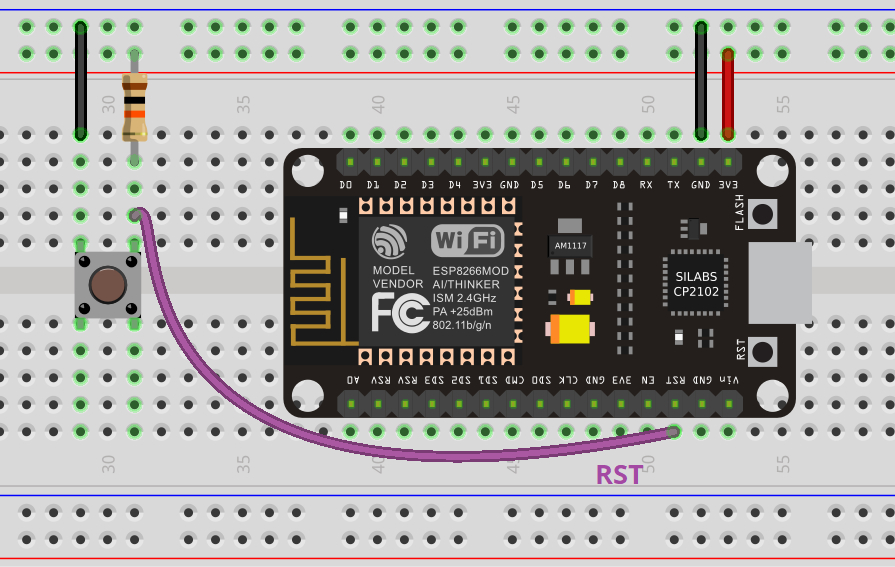
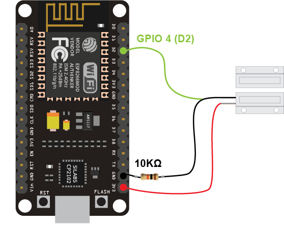

# Instruction for this code

the ESP8266 will automatically sleep after finishing the task, then start sleeping

there are 2 ways to trigger:
1. Use pushbutton and use Pull Down Resistor circuit, like this
   
2. Use Reed Switch and pull down resistor circuit, like this, but connect the green cable to RST pin on ESP board
   
