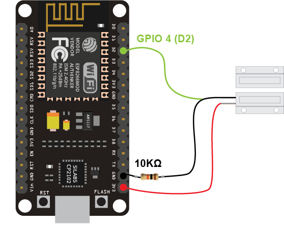

# Instruction for this code

There are two ways to use the reed switch:
1. Use Pull Down / Up Resistor, the image shown below is Pull Down Resistor, resulting 1 when closed, and 0 when opened
   
2. Use `INPUT_PULLUP` to pinMode, and just connect one wire of reed switch to GND, and the other to digital Pin
